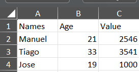

# Workshop - Robot Framework

# Lab-04 - Control Structures and Data Management

## Goal
 Create a test that reads data from a file and compare the results.

## Useful documentation

- [Python Documentation](https://docs.python.org/3/reference/index.html)
- [Robot Framework](https://robotframework.org/robotframework/latest/RobotFrameworkUserGuide.html)
- [rpaframework - RPA.Excel.Files](https://rpaframework.org/libdoc/RPA_Excel_Files.html)


## Steps

### 1. Setup
1. Install the following libraries
   ```pwsh
   # rpaframework Library
   pip install rpaframework
   ```

### 2. Create two Excel Files with two tables for comparison

1. Create a new directory ```data```
2. Create two Excel Files with two tables
   1. 


### 3. Create a new test file and implement the login test case
1. Create a Suite file ```lab4_test.robot```
2. Implement the test case
   1. Use the following Libraries: 
    ```
    Library    RPA.Excel.Files
    Library    Collections
    ```
   
## Running Tests
Run all tests in the `tests` folder:
```pwsh
python -m robot .\Lab-04\tests\lab4_test.robot
```
