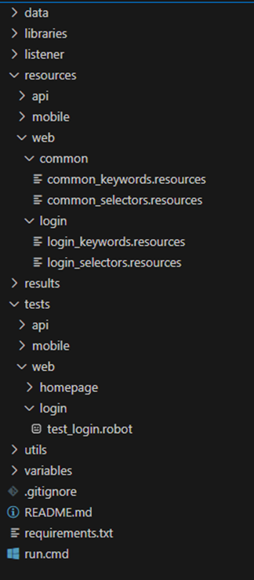

# Workshop - Robot Framework

# Lab-05 - Best Practices and Project Organization

## Goal
Ensure test code scalability and maintainability. Reorganize a set of tests from Lab-03 and applying best practices.

## Useful documentation

- [Python Documentation](https://docs.python.org/3/reference/index.html)
- [Robot Framework](https://robotframework.org/robotframework/latest/RobotFrameworkUserGuide.html)
- [SeleniumLibrary](https://robotframework.org/SeleniumLibrary/SeleniumLibrary.html)
- Page Object Model (POM)
- [Robot Framework - Tags](https://robotframework.org/robotframework-RFCP-syllabus/docs/chapter-04/tags)
- [Python - Dotenv](https://pypi.org/project/python-dotenv/)

## General Best Practices
This document outlines the best practices for developing, structuring, and maintaining automated test cases using Robot Framework

### 1. Project Structure
A consistent and modular directory structure improves scalability:



### 2. Modularity & Reusability

- Use resource files (.resource) to define shared keywords. 
- Abstract logic using custom Python libraries when needed.
- Isolate locators into separate resource files.

### 3. Scalability

- Avoid duplication of code.
- Keep test cases short and high-level: aim for 5–10 steps per test.
- Use Setup/Teardown to avoid redundancy in preconditions.
- Implement tagging for grouping and selective execution.


## 2. Naming Conventions
A consistent and modular directory structure improves scalability:

### 1. Files and Directories
|      Type     |   Convention                   |   Example                 |
|     :----:    |   :---:                        |   :-------:               |
|Test Suite     |   test_<feature>.robot         |   test_login.robot        |
|Resource File  |   \<feature>_keywords.resource |   login_ keywords.resource|
|Variable File  |   \<feature>_variables.py      |   login_variables.py      |


Use lowercase_with_underscores for files.

### 2. Keyword Naming

- Use descriptive, readable names.
- Follow action + subject structure: 
  	```
    Ex. 
    Click Login Button, 
    Fill Username Field
    Verify User Is Logged In
    ```

## 3. Documentation Standards

### 1. Test Case
Test cases can also have their own settings.
- **Documentation:** Used for specifying test case documentation.
- **Setup and Teardown:** Specify test setup and teardown.
- **Tags:** Used for tagging test cases.
- **Template:** Specifies the template keyword to use. The test itself will contain only data to use as arguments to that keyword.
- **Timeout:** Used for setting a test case timeout. Timeouts are discussed in their own section.

**Example:**
```
*** Test Cases ***
Valid Login Should Succeed
  [Documentation]   Tests valid login with correct credentials.
  [Tags]    smoke    login
  Open Login Page
  Input Credentials    user    pass123
  Submit Login
  Verify User Is Logged In
```
	Use tags to filter test types or priorities in pipelines.

### 2. Resources
**Example:**
```
*** Keywords ***

Input Credentials

    [Arguments]    ${username}    ${password}
    Input Text    username_field    ${username}
    Input Text    password_field    ${password}

```

## 4. Test Type Guidelines

### 1. Common

1. Create files for configuration data
2. Isolate sensitive data such as tokens and credentials in .env files
3. Use reusable keywords and shared libraries.
4. Hard-coded waits should be avoided, resorting to dynamic waits, e.g., validating state changes or actions taken.
5. Add ‘tags’ to test cases that allow them to be grouped into different suites e.g. @Regression @Sanity

### 2. Web Testing

1. Use Page Object Model via resource files:
 	```
      login_keywords.resource
      dashboard_keywords.resource
    ```

2. Store selectors in variable files:
 	```
    login_selectors.resource
    dashboard_selectors.resource
    ```
3. Use SeleniumLibrary or other and define browser setup in one place.
4. Avoid fragile selectors (dynamic IDs, unstable CSS).
5. Ensure a dynamic choice of browser or other configuration to be used in test execution

### 3. Mobile Testing

1. Use AppiumLibrary.
2. Maintain device capabilities in a config file.
3. Modularize device-specific interactions (e.g., gestures, keyboard input).

### 4. API Testing

1. Use RequestsLibrary or HTTP library.
2. Store base URLs and tokens in variable files or CI secrets.
3. Structure test cases as follows:
   * Setup token/session
   * Perform request
   * Validate status and body


## 5. Error Handling & Logs
1. Use Run Keyword And Continue On Failure for non-critical validations.
2. Capture screenshots on failure in web/mobile tests.
3. Log helpful messages: 
    ```
    Log    Verifying login was successful
    ```

# Practical Activity - Steps

### 1. Setup
Install the following libraries
   ```pwsh
   # python-dotenv Library
   pip install python-dotenv
   ```


pip install python-dotenv
### 2. Implement Page Object Mode by reusing the Lab-03 test case. 


### 3. Apply a naming Convention for this project.
1. Directories: ``` e.g. library ```
2. Test Suite:``` e.g. labX_test.robot ```
3. Keywords:``` e.g. PAGE_keyword.resource ```
4. Variables:``` e.g. ${VARIABLE_NAME} ```
5.    ...


### 4. Apply Documentation
1. Should be used the syntax ``` [Documentation] ``` to describe the script/test/keyword
2. Tags should be used to facilitate the execution and analysis of reports. Use ``` [Tags] ``` for each test case.


## Running Tests
Run all tests in the `tests` folder:

To run tests folder
```Shell
python -m robot --outputdir .\Lab-05\results  .\Lab-05\tests\lab5_test.robot 
```

To run scenarios by tag
```Shell
python -m robot --outputdir .\Lab-05\results -i <TAG> .\Lab-05\tests\lab5_test.robot
```


